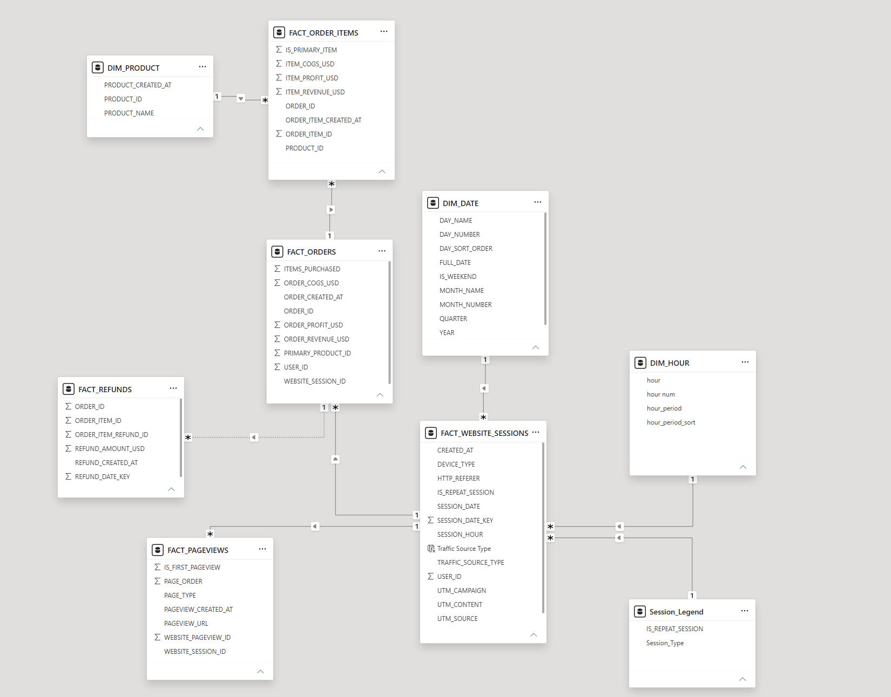
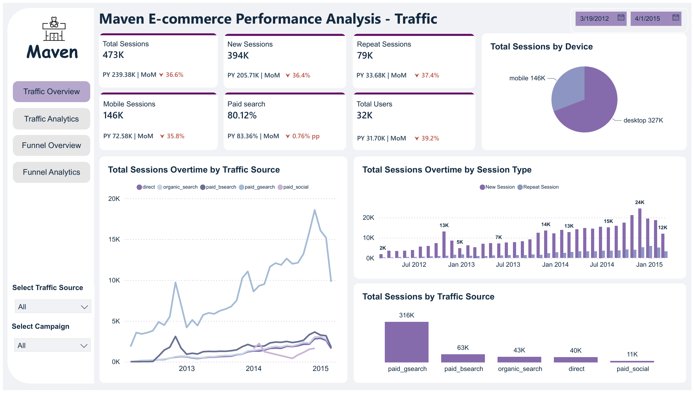
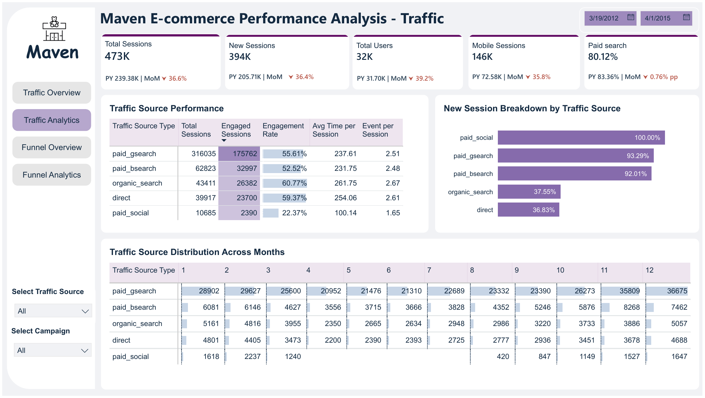
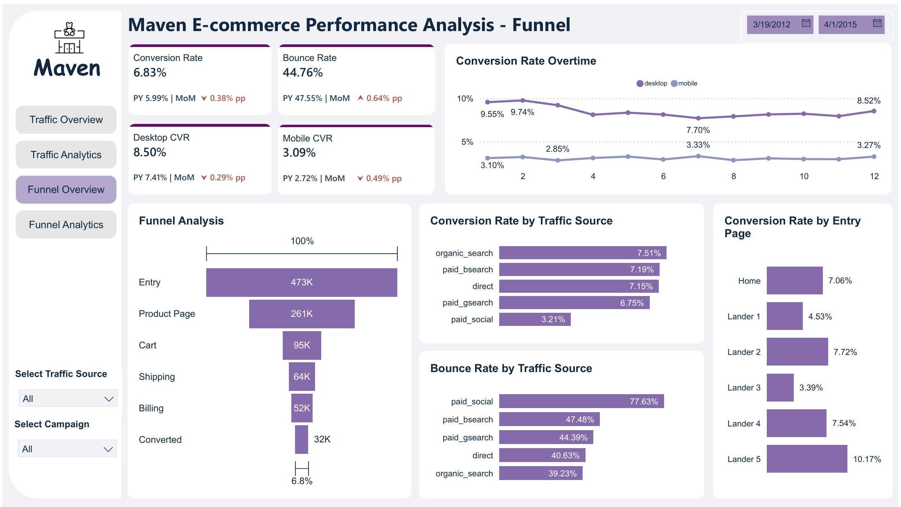
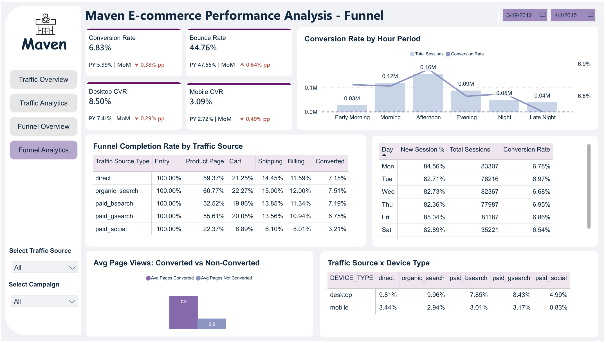

# Maven Fuzzy Factory — E-Commerce Traffic & Funnel Analytics


---

## 🔗 Live Dashboard

> **[View Interactive Dashboard on Power BI Service →](https://app.powerbi.com/view?r=eyJrIjoiZGE5MTFjYWItMWE3My00NWM2LTgxY2UtMWM5MGYxYjFmZmEzIiwidCI6ImJlODMyOWE3LTcyMTgtNDlhMy05YWMxLWQ3Yjk1NDU2M2YzOSIsImMiOjEwfQ%3D%3D)**
>
> No Power BI account or installation required — opens directly in your browser.

---

## Table of Contents

1. [Introduction](#introduction)
2. [Problem Statement](#problem-statement)
3. [Skills Demonstrated](#skills-demonstrated)
4. [Data Sourcing](#data-sourcing)
5. [Data Transformation](#data-transformation)
6. [Modelling](#modelling)
7. [Analysis & Visualisation](#analysis--visualisation)
8. [Conclusion & Recommendations](#conclusion--recommendations)

---

## Introduction

Maven Fuzzy Factory is a fictional e-commerce company used as a learning dataset by Maven Analytics. This project presents a **full end-to-end analytics pipeline** — from raw CSV data ingested into Snowflake, through a star schema transformation layer, to an interactive Power BI dashboard — designed to give stakeholders a clear view of website traffic performance and customer conversion behaviour across the period **March 2012 – April 2015**.

### Project Architecture

```
CSV Source Files
      ↓
Snowflake (RAW_DB)         — raw ingestion layer
      ↓
Snowflake (ANALYTICS_DB)   — star schema transformation layer
      ↓
Power BI                   — semantic model + interactive dashboard
```

The dashboard is structured across four report pages — **Traffic Overview**, **Traffic Analytics**, **Funnel Overview**, and **Funnel Analytics** — enabling both high-level monitoring and deep-dive analysis of how users discover, engage with, and convert through the Maven Fuzzy Factory website.

---

## Problem Statement

Maven Fuzzy Factory's marketing and product teams need a centralised reporting solution to answer key questions about their website traffic and sales funnel. Without a unified view, it is difficult to identify which channels drive quality traffic, where customers drop off in the purchase journey, and how performance trends over time.

### Business Questions to Solve

**Traffic Performance**
- How have total sessions, new sessions, and repeat sessions trended over time?
- What proportion of total traffic comes from mobile vs. desktop devices?
- Which traffic sources (paid search, organic, direct, paid social) are driving the most sessions?
- How does paid search as a share of total traffic change month over month and year over year?

**Traffic Quality & Engagement**
- Which traffic source delivers the highest session engagement rate and average time on site?
- How do new session rates differ across traffic sources — which channels attract mostly first-time visitors vs. returning users?
- How is traffic distributed across months of the year, and are there seasonal patterns by source?

**Conversion & Funnel Performance**
- What is the overall website conversion rate, and how has it changed over time?
- How do conversion rates differ between desktop and mobile users?
- At which stage of the funnel (Product Page → Cart → Shipping → Billing → Converted) do the most sessions drop off?
- Which traffic sources have the highest and lowest funnel completion rates?
- Which entry landing pages convert best, and which have the highest bounce rates?

**Behavioural Patterns**
- What time of day sees the highest volume of sessions, and does conversion rate vary by hour period?
- Which day of the week drives the most sessions and the highest conversion rate?
- How many page views do converted users view compared to non-converted users?
- How do conversion rates break down by the combination of traffic source and device type?

---

## Skills Demonstrated

**Snowflake & SQL**
- Two-layer database architecture (`RAW_DB` → `ANALYTICS_DB`) separating ingestion from analytics
- Snowflake-native `GENERATOR` function for building a static date spine — zero dependency on fact tables
- Window functions for analytical computation at the database layer
- Business logic embedded in SQL — traffic source classification and funnel stage mapping via `CASE` statements
- Structured data quality checks — row counts, duplicate detection, null validation, date range verification

**Power BI**
- Star schema semantic model with fact and dimension tables
- DAX measures including KPIs, MoM % change, PY comparisons, conversion rates, bounce rates, and engagement metrics
- Power Query (M Language) for data connection, column selection, and static dimension table generation
- Multi-page interactive report with consistent branding, slicers, cross-filtering, and drill-through capability
- Intuitive navigation with sidebar menu, date range pickers, and conditional formatting

---

## Data Sourcing

- **Source:** [Maven Analytics – E-Commerce Dataset](https://app.mavenanalytics.io/datasets?search=e-commerce)
- **Format:** CSV files (6 tables)
- **Coverage:** March 2012 – April 2015

### Raw Tables (`RAW_DB.PUBLIC`)

| Table | Rows | Description |
|---|---|---|
| `ORDERS` | 32,313 | Order-level records with revenue and COGS |
| `ORDER_ITEMS` | 40,025 | Line items per order including product and price |
| `ORDER_ITEM_REFUNDS` | 1,731 | Refund records linked to order items |
| `PRODUCTS` | 4 | Product dimension with names and creation dates |
| `WEBSITE_SESSIONS` | 472,871 | Session-level data with traffic source, device type, UTM parameters |
| `WEBSITE_PAGEVIEWS` | ~1,188,124 | Pageview-level data per session |

### A Note on Null Values in the Dataset

The `UTM_CAMPAIGN`, `UTM_SOURCE`, and `UTM_CONTENT` fields contain null values for a significant portion of sessions. **This is expected and correct behaviour** — not a data quality issue.

UTM parameters only exist for **paid traffic**, where a marketer deliberately tags a URL before launching a campaign. Sessions arriving through organic search or direct navigation carry no UTM parameters by design:

| Traffic Type | UTM_CAMPAIGN | Reason |
|---|---|---|
| `paid_gsearch` | populated | Marketer-tagged paid Google Search URLs |
| `paid_bsearch` | populated | Marketer-tagged paid Bing Search URLs |
| `paid_social` | populated | Marketer-tagged paid social URLs |
| `organic_search` | **null** | Google/Bing organic clicks do not carry UTM parameters |
| `direct` | **null** | Users typed the URL directly — no tracking exists |

In the transformation layer, these nulls are handled by a `CASE` statement in `FACT_WEBSITE_SESSIONS` that classifies each session into a clean `TRAFFIC_SOURCE_TYPE` label based on the combination of `UTM_SOURCE`, `UTM_CAMPAIGN`, and `HTTP_REFERER` — eliminating null values entirely at the reporting layer.

---

## Data Transformation

All transformations are performed in Snowflake using three structured SQL scripts before any data enters Power BI.

### File 1 — `e-commerce_setup.sql` (One-time environment setup)

- Creates `RAW_WAREHOUSE` (X-Small, auto-suspend 60s) for cost-efficient compute
- Creates two databases: `RAW_DB` (ingestion layer) and `ANALYTICS_DB` (analytics layer)
- Defines two CSV file formats — `CSV_CRLF` for Windows line endings and `CSV_LF` for Unix line endings with quoted fields
- Creates a single internal staging area `@STG_RAW` to hold all 6 source CSV files

### File 2 — `e-commerce_raw_tables.sql` (Ingestion + data quality)

- Creates 6 raw tables as exact mirrors of source CSV structure — no transformations applied
- Loads data via `COPY INTO` with `FORCE = TRUE` to ensure clean reloads
- Runs comprehensive data quality checks:
  - Row counts across all 6 tables
  - Duplicate detection on all primary keys
  - Null checks on all critical foreign keys
  - Expected null analysis on UTM fields (documented above)
  - Date range validation

### File 3 — `e-commerce_normalisation.sql` (Star schema build)

Key transformations applied:

**DIM_DATE — Snowflake-native date spine**
Instead of scanning and UNIONing all fact tables to derive dates (which is resource-wasteful), `DIM_DATE` is generated using Snowflake's `GENERATOR` function — producing a complete date spine from 2012-01-01 to 2016-12-31 instantly with zero database reads. Includes `DAY_SORT_ORDER` and `IS_WEEKEND` for enhanced time intelligence.

**FACT_WEBSITE_SESSIONS — Traffic source classification**
Business logic embedded directly in SQL using a `CASE` statement on `UTM_SOURCE`, `UTM_CAMPAIGN`, and `HTTP_REFERER` to produce a clean `TRAFFIC_SOURCE_TYPE` column:
- `paid_gsearch` — Google paid search
- `paid_bsearch` — Bing paid search
- `paid_social` — Paid social (socialbook)
- `organic_search` — Referral from search engine without UTM
- `direct` — No source, no referrer

**FACT_PAGEVIEWS — Window functions for pageview ranking**
`PAGE_ORDER` and `IS_FIRST_PAGEVIEW` are computed using `ROW_NUMBER() OVER (PARTITION BY website_session_id ORDER BY created_at ASC)` directly in Snowflake. This replaces equivalent DAX calculated columns in Power BI which would create O(N²) row-context loops across 1M+ rows — causing significant performance degradation.

**Profit calculations**
`order_profit_usd` and `item_profit_usd` are computed as `price_usd - cogs_usd` at the SQL layer, keeping DAX measures simple.

---

## Modelling

The Power BI semantic model follows a **star schema** design, with `FACT_WEBSITE_SESSIONS` as the central hub connecting to all other tables.



### Fact Tables
| Table | Rows | Description |
|---|---|---|
| `FACT_WEBSITE_SESSIONS` | 472,871 | One row per session — central hub of the model |
| `FACT_PAGEVIEWS` | ~1,188,124 | One row per pageview with funnel stage and page order |
| `FACT_ORDERS` | 32,313 | One row per order with revenue and profit |
| `FACT_ORDER_ITEMS` | 40,025 | One row per order line item |
| `FACT_REFUNDS` | 1,731 | One row per refund transaction |

### Dimension Tables
| Table | Description |
|---|---|
| `DIM_DATE` | Full date spine 2012–2016 with day/month/quarter attributes and sort order |
| `DIM_HOUR` | 24-row static table with hour period labels and sort order |
| `DIM_PRODUCT` | Product lookup with names and creation dates |
| `Session_Legend` | Maps `IS_REPEAT_SESSION` flag to New/Repeat Session label |
| `FunnelStages` | Ordered funnel stage definitions with URL filters |
| `LanderStages` | Maps landing page URLs to display labels |

### Key Relationships
- `DIM_DATE` (1) → `FACT_WEBSITE_SESSIONS` (*) on `SESSION_DATE`
- `FACT_WEBSITE_SESSIONS` (1) → `FACT_ORDERS` (*) on `WEBSITE_SESSION_ID`
- `FACT_WEBSITE_SESSIONS` (1) → `FACT_PAGEVIEWS` (*) on `WEBSITE_SESSION_ID`
- `FACT_ORDERS` (1) → `FACT_ORDER_ITEMS` (*) on `ORDER_ID`
- `DIM_PRODUCT` (1) → `FACT_ORDER_ITEMS` (*) on `PRODUCT_ID`
- `DIM_HOUR` (1) → `FACT_WEBSITE_SESSIONS` (*) on `hour_period`

> **Important:** `FACT_WEBSITE_SESSIONS` sits on the **One** side of its relationship with `FACT_ORDERS`. This ensures date and traffic source filters correctly propagate from sessions into orders, enabling accurate time-based conversion rate calculations.

---

## Analysis & Visualisation

### Page 1 — Traffic Overview



High-level summary of website session volume and traffic composition over time.

**KPI Cards:** Total Sessions, New Sessions, Repeat Sessions, Mobile Sessions, Paid Search %, Total Users — each with Prior Year (PY) and Month-over-Month (MoM) comparisons.

**Visuals:**
- Donut chart — Total Sessions split by device type (Desktop vs. Mobile)
- Line chart — Total Sessions by Month and Traffic Source Type
- Stacked bar chart — Total Sessions by Month and Session Type (New vs. Repeat)
- Bar chart — Total Sessions by Traffic Source (absolute volume)

---

### Page 2 — Traffic Analytics



Deep-dive into traffic quality and engagement by source.

**Visuals:**
- Summary table — Traffic Source Type × Total Sessions, Engaged Sessions, Engagement Rate, Avg Time per Session, Events per Session (with conditional formatting)
- Horizontal bar chart — New Session % by Traffic Source
- Heat map matrix — Traffic Source Distribution Across Months

---

### Page 3 — Funnel Overview



Understand how sessions progress through the purchase funnel and where drop-off occurs.

**KPI Cards:** Conversion Rate, Bounce Rate, Desktop CVR, Mobile CVR — with PY and MoM comparisons.

**Visuals:**
- Funnel bar chart — Entry → Product Page → Cart → Shipping → Billing → Converted (overall 6.83% CVR)
- Line chart — Conversion Rate over Time by device type (Desktop vs. Mobile)
- Bar charts — Conversion Rate and Bounce Rate by Traffic Source Type
- Bar chart — Conversion Rate by Entry Page (Home, Lander 1–5)

---

### Page 4 — Funnel Analytics



Granular analysis of conversion behaviour by time, day, traffic source, and device.

**Visuals:**
- Combo chart — Conversion Rate by Hour Period with session volume bars
- Funnel completion table — Stage-by-stage drop-off rates by Traffic Source Type
- Daily Performance Summary — Day × New Session %, Total Sessions, Conversion Rate
- Clustered bar chart — Avg Page Views: Converted vs. Non-Converted
- Matrix — Traffic Source × Device Type Conversion Rate cross-tab

---

## Conclusion & Recommendations

### Key Findings

- **Paid Google Search dominates traffic** — 316K of 473K total sessions (~67%), making it the most critical channel to optimise and protect
- **Mobile is a significant segment** — 146K sessions (31% of total), yet Mobile CVR (3.09%) is less than half of Desktop CVR (8.50%), signalling a UX gap
- **Paid Social has the lowest conversion rate** (3.21%) and highest bounce rate (77.63%), suggesting sessions from this source are largely unqualified
- **Organic search delivers the highest conversion rate** (7.51%) and strong engagement (60.77%), indicating strong purchase intent
- **Biggest funnel drop-off is Entry → Product Page** — only 55% of sessions reach the product page — the largest single improvement opportunity
- **Lander 5 outperforms all other landing pages** at 10.17% CVR vs. 3.39% for Lander 3, confirming landing page content materially impacts conversion
- **Afternoon is peak traffic period** with 155K sessions, while conversion rate stays stable (~6.8–6.9%) across hour periods

### Recommendations

1. **Improve mobile experience** — prioritise mobile UX optimisation across product page, cart, and checkout to close the desktop–mobile CVR gap
2. **Reduce paid social spend or refine targeting** — the high bounce rate and low CVR suggest audience misalignment; test dedicated social landing pages before scaling spend
3. **Scale what works in organic search** — analyse content, keywords, and landing pages driving organic conversions and replicate in paid campaigns
4. **A/B test the product page entry experience** — given the steep Entry → Product Page drop, test above-the-fold content, load speed, and calls to action
5. **Replicate Lander 5's design** — with the highest CVR (10.17%), its layout and messaging should inform redesigns of lower-performing landers
6. **Monitor repeat session growth** — invest in retention-focused campaigns and personalisation to improve lifetime value as the repeat visitor base grows

---

## Repository Structure

```
maven-fuzzy-factory/
│
├── sql/
│   ├── e-commerce_setup.sql          # Warehouse, databases, schemas, file formats, stage
│   ├── e-commerce_raw_tables.sql     # Raw table creation, CSV ingestion, data quality checks
│   └── e-commerce_normalisation.sql  # Star schema transformation with window functions
│
├── assets/
│   ├── screenshots/                  # Dashboard page screenshots
│   └── data-model/                   # Power BI data model diagram
│
├── data/                             # Source CSV files and data dictionary
├── MavenFuzzyFactory.pbix            # Power BI Desktop source file (requires Power BI Desktop)
└── README.md
```

---

*End-to-end analytics pipeline: Snowflake (data engineering) → Power BI (business intelligence)*  
*Data sourced from [Maven Analytics](https://app.mavenanalytics.io/datasets?search=e-commerce)*
